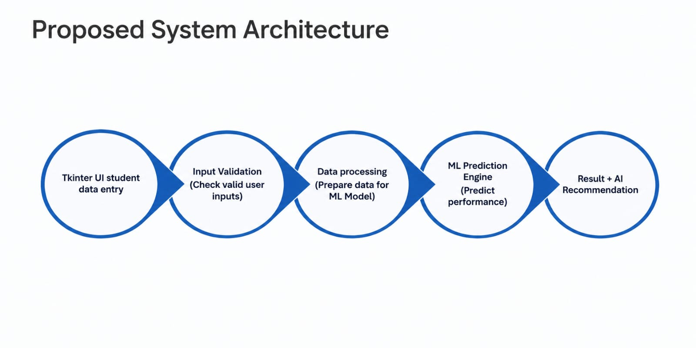
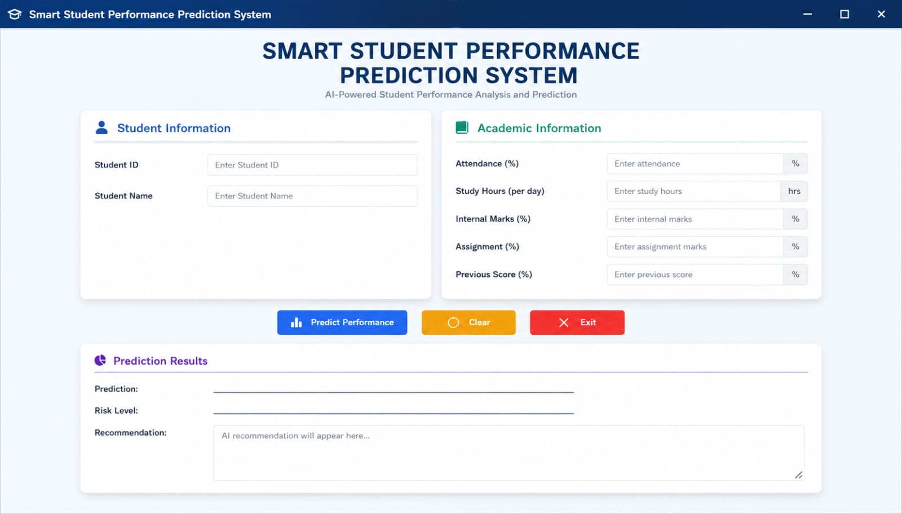

# Smart Student Performance Prediction System

## 1. PROBLEM STATEMENT:

- Student performance is influenced by multiple academic and behavioral factors.
- Faculty may find it difficult to identify students who are at risk at an early stage.
- A data-driven system can help to predict student performance.
- The system can provide recommendation for improving student outcomes.
---

## 2. PROPOSED SOLUTION:

- Collect student-related information.
- process the entered data.
- Use a machine learning model to predict performance.
- Classify students based on predict performance.
- Generate intelligence recommendations.
- Display the prediction results through a simple and user-friendly tkinter interface.

---

## 3. PROCESS FLOW:

The overall process of the Smart Student Performance Prediction System is:

```text
                         Start
                           ↓
                 Enter Student Details
                           ↓
                      Validate Input
                           ↓
                      Preprocess Data
                           ↓
                      ML Prediction
                           ↓
                 Determine Performance Level
                           ↓
                Generate AI Recommendation
                           ↓
                      Display Result
                           ↓
                          End
   ```

## 4. PROJECT MAPPING:

| V-Model Stage | Smart Student Project |
|---|---|
| Requirement Analysis | Identify student performance problem |
| System Design | Design system architecture and UI |
| Implementation | Develop Python + ML application |
| Integration | Integrate UI, ML and AI |
| Testing | Test individual modules and complete system |
| Validation | Check system against requirements |
| Demonstration | Present working capstone |

## 5. PROJECT - MODULAR APPLICATION DEVELOPMENT:

Create separate functions:

```
get_student_data()
calculate_average()
calculate_performance()
display_result()
```
## 6. REQUIREMENT ANALYSIS:

### 6.1 FUNCTIONAL REQUIREMENTS:

The system should:

- Accept student details.
- Validate user inputs.
- Store/process student information.
- Preprocess input data.
- Apply the trained ML model.
- Predict student performance.
- Generate recommendations.
- Display results through the GUI.
- Handle invalid inputs.
- Provide a reset/clear option.

### 6.2 NON-FUNCTIONAL REQUIREMENTS:

The application should be:

- User-friendly
- Easy to understand
- Fast in generating predictions
- Reliable
- Maintainable
- Scalable
- Secure with respect to student data
- Easy to test

### 6.3 IDENTIFY THE USER:

Primary users may include:

- Faculty
- Academic coordinators
- Mentors
- Students

### 6.4 USER REQUIREMENT:

The user should be able to:

- Enter student information.
- Submit the information for analysis.
- View predicted performance.
- Understand the student's risk level.
- Receive improvement recommendations.

### 6.5 IDENTIFY SYSTEM INPUTS:

The initial system can use:

- Student ID
- Student Name
- Attendance Percentage
- Study Hours per Day
- Internal Assessment Marks
- Assignment Completion Percentage
- Previous Academic Performance

### 6.6 IDENTIFY SYSTEM OUTPUTS:

#### 6.6.1 PERFORMANCE PREDICTION:

- Excellent
- Good
- Average
- At Risk

#### 6.6.2 ADDITIONAL OUTPUT:

- Prediction score/probability
- Risk level
- Key factors affecting performance
- Recommended actions

## Example:

Prediction: Good Performance

Risk Level: Low

Recommendation : Maintain current study pattern and attendance 


### 8.Objective
- Understand the **System Design phase** of the V-Model.
- Convert Day 1 requirements into a software architecture.
- Design the workflow of the Smart Student Performance Prediction System.
- Understand the fundamentals of **GUI development using Tkinter**.
- Create windows, frames, labels, input fields, buttons, and message boxes.
- Apply layout management using `pack()`, `grid()`, and `place()`.
- Implement event-driven programming using button callbacks.
- Validate user inputs.
- Develop a functional **Tkinter prototype** for the student performance prediction system.

---

### 9.From Requirements to System Design

**1. Inputs**
- Student ID
- Student Name
- Attendance %
- Study Hours
- Internal Marks
- Assignment Completion %
- Previous Academic Performance

**2. Processing**
- Validate input
- Preprocess data
- Send data to ML model
- Generate prediction
- Generate recommendation

**3. Outputs**
- Predicted performance
- Performance category
- Risk level
- Recommendation

---
## 10. Proposed System Architecture

The proposed system architecture illustrates the overall workflow of the Smart Student Performance Prediction System, including data collection, preprocessing, prediction, and performance analysis.



               
### 11. UI Design Requirements

The application should contain:

**1. Student Information Section**
- Student ID
- Student Name

**2. Academic Information Section**
- Attendance
- Study Hours
- Internal Marks
- Assignment Completion
- Previous Performance

**3. Action Section**
- Predict Performance
- Clear
- Exit

**4. Result Section**
- Predicted Performance
- Risk Level
- Recommendation

---

### 12.Using Frames (organize a large application)

**Main Window**
- Header frame
- Student information frame
- Academic information frame
- Action frame
- Result frame

### 13. Workflow

                    User clicks predict
                           ↓
                    Button generates event
                           ↓
                    callback function executes
                           ↓
                     python processing starts


## 14. UI EXAMPLE

The following screenshot shows an example of the user interface of the Smart Student Performance Prediction System.



# Day 3 — Machine Learning Fundamentals

---

## Objective

- Understand the fundamentals of **Machine Learning (ML)**
- Differentiate between traditional programming and ML-based systems
- Work with datasets using **Pandas & NumPy**
- Perform **data preprocessing and feature selection**
- Train a **Machine Learning model** for prediction
- Evaluate model performance using basic metrics
- Replace Day 2 rule-based logic with an ML-based prediction system
- Prepare the ML model for integration with Tkinter UI

---

## Traditional Programming vs ML

| Traditional Programming | Machine Learning |
|---|---|
| Rules are written manually | Model learns rules from data |
| Output = Logic + Input | Output = Model + Input |
| Fixed logic | Adaptive learning |

---

## ML Workflow

```
Data Collection
      ↓
Data Preprocessing
      ↓
Feature Selection
      ↓
Model Training
      ↓
Model Evaluation
      ↓
Prediction
```

---

## ML Workflow — Activities

**Activity 1 – Dataset Creation**
- Create student dataset in CSV
- Add 20–50 records

**Activity 2 – Data Loading**
- Load dataset using Pandas
- Display dataset

**Activity 3 – Data Cleaning**
- Remove missing values
- Check data types

**Activity 4 – Model Training**
- Train Logistic Regression model
- Split dataset

**Activity 5 – Model Evaluation**
- Calculate accuracy
- Analyze results

**Activity 6 – Prediction**
- Test model with new input

**Activity 7 – Save Model**
- Save model using pickle

---

##  Outcomes:

Should complete:
- Dataset (CSV file)
- Data preprocessing code
- Trained ML model
- Accuracy report
- Prediction function
- Saved model file (.pkl)
-

